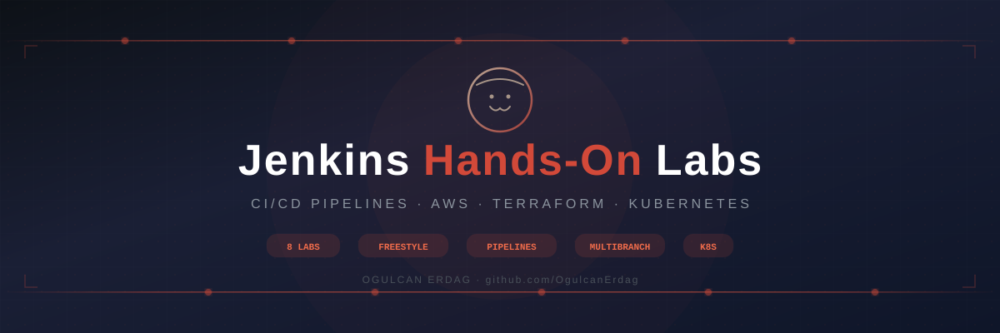

<p align="center">
  
</p>

<p align="center">
  
  
  
  
  
  
  
  
</p>

<h3 align="center">🔧 End-to-end Jenkins CI/CD Labs — from installation to Kubernetes deployments</h3>

---

## 📋 Overview

This repository contains a comprehensive series of **Jenkins CI/CD hands-on labs**, progressing from basic installation to advanced pipeline architectures including Multibranch Pipelines and Kubernetes deployments. All labs are built on **AWS EC2 (Amazon Linux 2023)** infrastructure, provisioned with **Terraform** where applicable.

Each session builds on the previous one, creating a structured learning path that mirrors real-world DevOps workflows.

---

## 🗂️ Lab Structure

| #   | Session                                                                                         | Topic                                      | Key Concepts                                              |
| --- | ----------------------------------------------------------------------------------------------- | ------------------------------------------ | --------------------------------------------------------- |
| 🏗️  | **[create-jenkins-server-tf](./create-jenkins-server-tf/)**                                     | Jenkins Server Provisioning with Terraform | IaC, AWS EC2, user-data, Security Groups                  |
| 01  | **[Session-1-installing-jenkins](./Session-1-installing-jenkins/)**                             | Installing Jenkins on Amazon Linux 2023    | Jenkins setup, Freestyle Jobs, Build Steps                |
| 02  | **[Session-2a-triggers](./Session-2a-triggers/)**                                               | Triggering Jenkins Jobs                    | Poll SCM, GitHub Webhooks, Build Triggers                 |
| 03  | **[Session-2b-maven](./Session-2b-maven/)**                                                     | Java & Maven Jobs in Jenkins               | Maven builds, JDK config, Declarative Pipelines           |
| 04  | **[Session-3a-tomcat](./Session-3a-tomcat/)**                                                   | Tomcat Installation & Configuration        | Staging/Production setup, WAR deployment                  |
| 05  | **[Session-3b-Deployment](./Session-3b-Deployment/)**                                           | Deploying to Staging/Production            | Publish Over SSH, Automated Deployment                    |
| 06  | **[Session-4-agent-node&DSL-job](./Session-4-agent-node%26DSL-job/)**                           | Agent Nodes & DSL Jobs                     | Distributed builds, Jenkins DSL, Node config              |
| 07  | **[Session-5-Folder-MultibranchPipeline](./Session-5-Folder-MultibranchPipeline/)**             | Folders & Multibranch Pipeline             | Jenkins Folders, Branch discovery, Jenkinsfile per branch |
| 08  | **[jenkins-07_kubernetes-project-with-jenkins](./jenkins-07_kubernetes-project-with-jenkins/)** | Kubernetes Deployment Pipeline             | ECR, Docker build, K8s manifests, Full CI/CD              |

---

## 🛠️ Tech Stack

- **CI/CD:** Jenkins (Freestyle, Pipeline, Multibranch Pipeline, DSL)
- **Cloud:** AWS (EC2, ECR, Security Groups, IAM)
- **IaC:** Terraform
- **Containers:** Docker, Kubernetes (kubeadm)
- **Build Tools:** Maven, Java (JDK)
- **Deployment:** Tomcat, Publish Over SSH, K8s manifests
- **OS:** Amazon Linux 2023

---

## 🚀 Learning Path

```
┌─────────────────────────────────────────────────────────────────┐
│  1. SETUP          Terraform → EC2 → Jenkins Installation       │
├─────────────────────────────────────────────────────────────────┤
│  2. BASICS         Freestyle Jobs → Triggers → Webhooks         │
├─────────────────────────────────────────────────────────────────┤
│  3. BUILD          Maven → Java → Declarative Pipelines         │
├─────────────────────────────────────────────────────────────────┤
│  4. DEPLOY         Tomcat → Staging → Production (SSH)          │
├─────────────────────────────────────────────────────────────────┤
│  5. SCALE          Agent Nodes → DSL Jobs → Distributed Builds  │
├─────────────────────────────────────────────────────────────────┤
│  6. ADVANCED       Folders → Multibranch Pipeline               │
├─────────────────────────────────────────────────────────────────┤
│  7. KUBERNETES     Docker → ECR → K8s Deployment Pipeline       │
└─────────────────────────────────────────────────────────────────┘
```

---

## ⚙️ Prerequisites

- AWS Account with EC2 access
- Terraform installed locally
- Basic Linux command line knowledge
- GitHub account (for webhook-based triggers)
- Docker & Kubernetes fundamentals (for Session 07–08)

---

## 👤 Author

**Ogulcan Erdag**

[](https://ogulcan-erdag.com)
[](https://github.com/OgulcanErdag)
[](https://www.linkedin.com/in/ogulcan-erdag/)

---

## 📄 License

This project is for educational purposes. All labs were built and documented hands-on as part of my DevOps learning journey.
